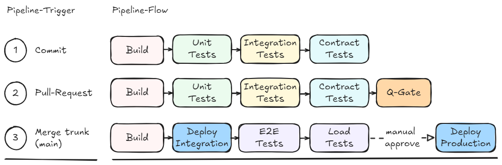
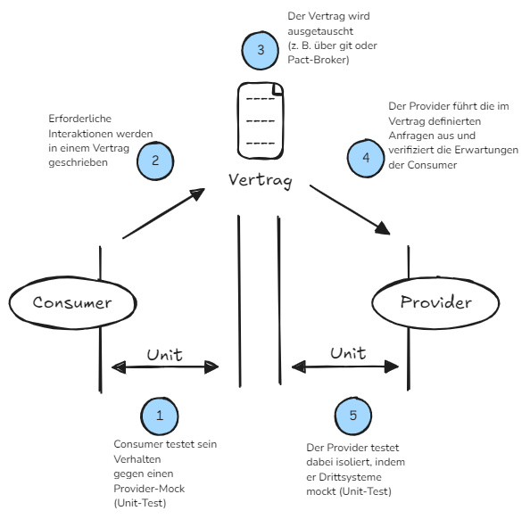

# DevOps-Demo Monorepo

Dieses Repo demonstriert ohne echte Business-App eine Testlandschaft für den Kurs DevOps:
Folgende Pipeline wird für das fiktive Unternehmen eingesetzt

## Projects
### **order-backend** (Spring-Boot)
  - Unit-Tests (Domänentest)
  - MockMVC-ITests (Integtationstest)
  - Pact Consumer (Contracttest)
### **product-backend** (Spring Boot)
  - Pact Provider (Contract-Verification-Test)

### **perf-gatling** (Maven-Modul)
  - Gatling-Simulation LoadProductKatalog
### **frontend** (Simple html+js)
  - E2E-Test with Cypress \

